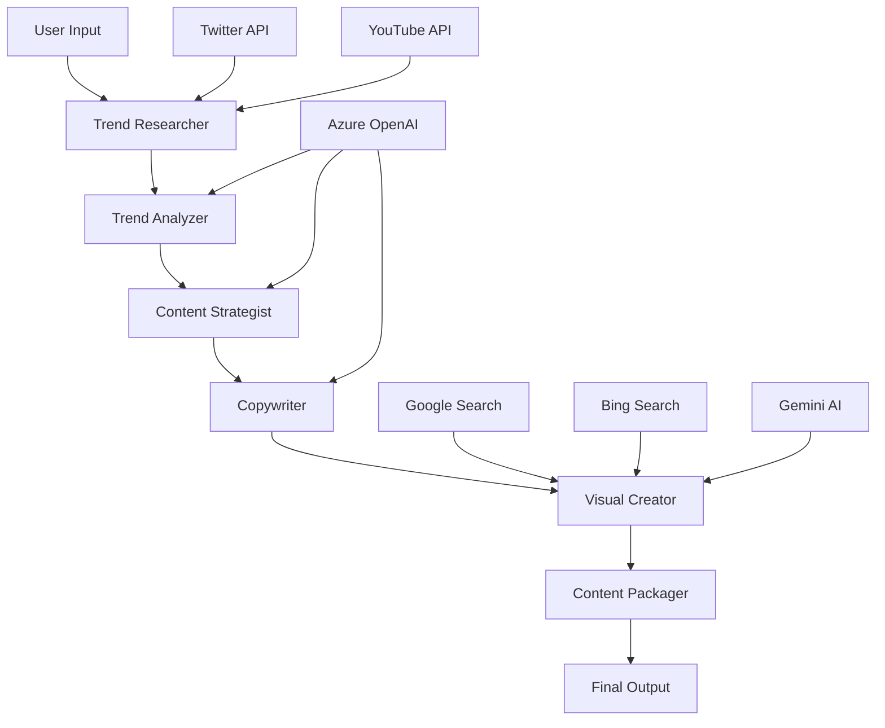

# 🎨 AI-Powered Multi-Agent Content Creation Studio

An intelligent, multi-agent system that automates social media content creation across multiple platforms using AI. The studio researches trends, analyzes data, generates strategic content, and creates visuals—all optimized for Twitter, LinkedIn, Instagram, and YouTube.

[](https://www.python.org/downloads/)
[](https://azure.microsoft.com/en-us/products/ai-services/openai-service)
[](LICENSE)

---

## 🌟 Features

### **Multi-Agent Architecture**
The studio employs specialized AI agents that work together in a coordinated workflow:

1. **🔍 Trend Researcher** - Discovers trending content across Twitter and YouTube
2. **📊 Trend Analyzer** - Analyzes sentiment, themes, and engagement triggers
3. **🎯 Content Strategist** - Develops platform-specific content strategies
4. **✍️ Copywriter** - Creates engaging, optimized content for each platform
5. **🎨 Visual Creator** - Generates or finds relevant images and media
6. **📦 Content Packager** - Assembles final deliverables with metadata

### **Content Generation**
- **Multi-Platform Support**: Twitter threads, LinkedIn posts, Instagram captions, YouTube scripts
- **Purpose-Driven Content**: Supports 13+ content types including:
  - Social Media Marketing
  - Advertisement
  - Educational
  - Entertainment
  - Quiz & Q&A
  - Lead Generation
  - Brand Awareness
  - Promotional
  - Engagement
  - Informational
- **Brand Voice Customization**: Tailor content tone to your brand identity
- **Platform-Specific Optimization**: Character limits, hashtags, CTAs adapted per platform

### **Visual Content**
Choose from three visual generation methods:

1. **📸 Stock Photos** (Pexels/Unsplash)
   - High-quality professional images
   - Royalty-free licensed content

2. **🌐 Real Media Search** (Google/Bing/Twitter)
   - Content-aware search queries
   - Multi-query strategy for better results
   - Quality filtering (minimum 800px resolution)
   - Stock site exclusion for authentic content
   - Source attribution included

3. **🎨 AI Generated** (Gemini)
   - Custom images based on content strategy
   - Contextual prompts from copywriter output
   - Aligned with SEO keywords and themes

### **Smart Features**
- **Trend Analysis**: Real-time data from Twitter API and YouTube Data API
- **Content Validation**: Topic-specific checks to prevent generic content
- **SEO Optimization**: Keyword integration and hashtag generation
- **Engagement Optimization**: Hooks, triggers, and CTAs based on analytics
- **Multi-Query Search**: Enhanced image relevance with content-aware search
- **Quality Filtering**: Automatic filtering of low-quality or stock images

### **Modern Web Interface**
- **Real-Time Dashboard**: Watch agents work in real-time
- **Workflow Visualizer**: See the content creation pipeline in action
- **Live Preview**: View generated content for all platforms
- **Glassmorphism Design**: Modern, professional UI with animations
- **Responsive Layout**: Works on desktop and mobile devices

---

## 🏗️ Architecture



The system uses a **sequential multi-agent workflow** where each agent builds upon the previous agent's work, creating a comprehensive content creation pipeline.

---

## 📋 Prerequisites

- **Python 3.8 or higher**
- **API Keys** (see Configuration section):
  - Azure OpenAI (required)
  - Twitter/X Bearer Token
  - YouTube Data API Key
  - Google Custom Search API (for real media)
  - Bing Search API (optional)
  - Pexels/Unsplash API Keys (for stock photos)

---

## 🚀 Installation

### 1. Clone the Repository
```bash
git clone <repository-url>
cd "Content Creation Studio"
```

### 2. Create Virtual Environment
```bash
python -m venv venv
```

### 3. Activate Virtual Environment
**Windows:**
```bash
venv\Scripts\activate
```

**macOS/Linux:**
```bash
source venv/bin/activate
```

### 4. Install Dependencies
```bash
pip install -r requirements.txt
```

### 5. Install Playwright (for Gemini AI image generation)
```bash
playwright install chromium
```

---

## ⚙️ Configuration

### 1. Create `.env` File
Create a `.env` file in the root directory with the following API keys:

```env
# ============================================================================
# AZURE OPENAI (REQUIRED)
# ============================================================================
AZURE_OPENAI_API_KEY=your_azure_openai_key
AZURE_OPENAI_ENDPOINT=https://your-resource.openai.azure.com/
AZURE_OPENAI_DEPLOYMENT_NAME=your_deployment_name
AZURE_OPENAI_API_VERSION=2024-02-15-preview

# ============================================================================
# SOCIAL MEDIA APIs
# ============================================================================
# Twitter/X API v2
TWITTER_BEARER_TOKEN=your_twitter_bearer_token

# YouTube Data API v3
YOUTUBE_API_KEY=your_youtube_api_key

# ============================================================================
# VISUAL CONTENT - STOCK PHOTOS
# ============================================================================
PEXELS_API_KEY=your_pexels_key
UNSPLASH_ACCESS_KEY=your_unsplash_key

# ============================================================================
# VISUAL CONTENT - REAL MEDIA SEARCH
# ============================================================================
# Google Custom Search API
GOOGLE_SEARCH_API_KEY=your_google_api_key
GOOGLE_SEARCH_ENGINE_ID=your_search_engine_id

# Bing Search API (optional)
BING_SEARCH_API_KEY=your_bing_api_key
```

### 2. API Key Setup Guides

<details>
<summary><b>Azure OpenAI API</b></summary>

1. Go to [Azure Portal](https://portal.azure.com/)
2. Create an Azure OpenAI resource
3. Deploy a GPT model (gpt-4 or gpt-3.5-turbo)
4. Copy the API key, endpoint, and deployment name
</details>

<details>
<summary><b>Twitter/X Bearer Token</b></summary>

1. Go to [Twitter Developer Portal](https://developer.twitter.com/)
2. Create a new app or use existing
3. Navigate to "Keys and tokens"
4. Generate or copy the Bearer Token
</details>

<details>
<summary><b>YouTube Data API</b></summary>

1. Go to [Google Cloud Console](https://console.cloud.google.com/)
2. Create a new project or select existing
3. Enable YouTube Data API v3
4. Create credentials (API Key)
5. Copy the API key
</details>

<details>
<summary><b>Google Custom Search API</b></summary>

1. Go to [Google Cloud Console](https://console.cloud.google.com/)
2. Enable Custom Search API
3. Create credentials (API Key)
4. Go to [Programmable Search Engine](https://programmablesearchengine.google.com/)
5. Create a search engine and get the Search Engine ID
</details>

<details>
<summary><b>Pexels API</b></summary>

1. Go to [Pexels API](https://www.pexels.com/api/)
2. Sign up for a free account
3. Copy your API key
</details>

<details>
<summary><b>Unsplash API</b></summary>

1. Go to [Unsplash Developers](https://unsplash.com/developers)
2. Create a new application
3. Copy your Access Key
</details>

---

## 💻 Usage

### Command Line Interface

Run the main script with interactive prompts:

```bash
python content_studio.py
```

You'll be prompted to enter:
- **Topic**: The subject of your content (e.g., "AI in Healthcare")
- **Platforms**: Comma-separated list (e.g., "twitter, linkedin, instagram, youtube")
- **Content Type**: Select from 13+ options (e.g., "post - Social Media Marketing")
- **Brand Voice**: Your desired tone (e.g., "professional yet engaging")
- **Visual Style**: Choose "stock", "real", or "ai"

### Web Interface

For a modern, visual experience, use the web UI:

#### 1. Launch Chrome (for AI image generation)
**⚠️ Required only if using "AI Generated (Gemini)" visuals**

```bash
.\launch_chrome.bat
```

- Log into Google/Gemini in the Chrome window that opens
- Keep the window open during content generation

#### 2. Start the Web Server
```bash
python web/api.py
```

#### 3. Open in Browser
Navigate to: [http://localhost:8000](http://localhost:8000)

**Features:**
- Real-time workflow visualization
- Live content preview for all platforms
- Modern glassmorphism UI
- Responsive design
- Interactive form with dropdowns

See [WEB_UI_README.md](WEB_UI_README.md) for detailed web UI documentation.

---

## 📁 Output Structure

Generated content is saved to `content_studio_output/` with the following structure:

```
content_studio_output/
├── topic_name_YYYYMMDD_HHMMSS/
│   ├── twitter.txt                 # Twitter thread
│   ├── linkedin.txt                # LinkedIn post
│   ├── instagram.txt               # Instagram caption
│   ├── youtube.txt                 # YouTube script
│   ├── metadata.json               # Full metadata (trends, analysis, strategy)
│   ├── twitter_image.jpg           # Platform-specific images
│   ├── linkedin_image.jpg
│   ├── instagram_image.jpg
│   └── youtube_thumbnail.jpg
```

### Content Format Examples

**Twitter Thread:**
```
Tweet 1/7:
🚀 Why AI in Healthcare is revolutionizing diagnosis...

Tweet 2/7:
AI models can now detect diseases 95% faster than traditional methods...
```

**YouTube Script:**
```
VIDEO TITLE: [SEO-optimized title]

VIDEO DESCRIPTION:
[Hook paragraph]
[Learning outcomes]
[Timestamps]
[Resources]

TAGS: [15 relevant tags]

SCRIPT:
[Full video script with sections]
```

---

## 🎯 Content Types & Purposes

The studio supports purpose-driven content creation:

| Purpose | Best For | Key Features |
|---------|----------|--------------|
| **Social Media Marketing** | Community engagement | Viral hooks, shareability |
| **Advertisement** | Product promotion | Conversion-focused CTAs |
| **Educational** | Teaching & training | Step-by-step learning |
| **Entertainment** | Engagement | Storytelling, humor |
| **Quiz** | Interactive content | Question-based threads |
| **Q&A** | Expert insights | Problem-solving answers |
| **Brand Awareness** | Building identity | Emotional storytelling |
| **Promotional** | Launches & events | Urgency and exclusivity |
| **Lead Generation** | Capturing leads | Value + lead magnets |
| **Engagement** | Interaction | Polls, questions |
| **Informational** | Facts & data | Credible insights |

Each purpose optimizes:
- Content structure and format
- Hooks and opening lines
- Call-to-action (CTA) style
- Tone and messaging
- Platform-specific adaptations

---

## 🖼️ Visual Generation Comparison

| Feature | Stock Photos | Real Media Search | AI Generated |
|---------|-------------|-------------------|--------------|
| **Quality** | Professional | Varies (filtered) | Consistent |
| **Relevance** | Generic | High (contextual) | Very High |
| **Uniqueness** | Low | Medium | High |
| **Setup** | API Key | API Keys | Chrome login |
| **Speed** | Fast | Fast | Slower |
| **Cost** | Free tier | Free tier | Free |
| **Attribution** | Not required | Provided | Not required |

### Real Media Search Features
- **Content-Aware Queries**: Automatically generates search queries based on post content
- **Multi-Query Strategy**: Uses 2-3 targeted queries per search
- **Quality Filtering**: Minimum 800px resolution
- **Stock Site Exclusion**: Filters out Getty, Shutterstock, etc.
- **Source Attribution**: Includes photographer and source URL

---

## 🔧 Advanced Configuration

### Custom Brand Voice
Edit the brand voice to match your brand identity:
```python
brand_voice = "playful and innovative with a tech-savvy edge"
```

### Platform Selection
Generate for specific platforms only:
```python
platforms = ["twitter", "linkedin"]  # Skip Instagram and YouTube
```

### Visual Style Priority
Set fallback preferences:
- If Gemini fails, the system automatically falls back to Real Media Search
- If Real Media Search fails, it falls back to Stock Photos

---

## 🛠️ Troubleshooting

### Common Issues

**"Could not connect to Chrome" (Gemini AI)**
- Run `.\launch_chrome.bat` before starting
- Ensure Chrome window stays open
- Log into Google/Gemini in the Chrome window

**"Twitter API Error: 429"**
- Rate limit exceeded
- System will use AI-generated mock trends instead
- Wait 15 minutes and try again

**"No images found"**
- Check API keys in `.env`
- Verify API quotas aren't exceeded
- System will attempt fallback methods

**"Azure OpenAI Error"**
- Verify API key and endpoint in `.env`
- Check deployment name matches
- Ensure API version is current

---

## 📊 Performance & Limits

- **Generation Time**: 30-90 seconds per complete content package
- **API Rate Limits**: Respects all API quotas with automatic retries
- **Content Quality**: Uses temperature 0.3-0.7 for balanced creativity
- **Image Quality**: Minimum 800px for real media searches
- **Multi-Query**: 2-3 queries per image search for better results

---

## 🤝 Contributing

Contributions are welcome! Please:
1. Fork the repository
2. Create a feature branch
3. Make your changes
4. Submit a pull request

---

## 🙏 Acknowledgments

- **Azure OpenAI** for GPT models
- **Twitter/X API** for trend data
- **YouTube Data API** for video trends
- **Google Custom Search** for real media
- **Pexels & Unsplash** for stock imagery
- **Gemini AI** for image generation

---

## 📞 Support

For issues, questions, or feature requests:
- Open an issue on GitHub
- Check the [WEB_UI_README.md](WEB_UI_README.md) for web interface help

---

## 🔮 Future Enhancements

- [ ] TikTok content generation
- [ ] Reddit post creation
- [ ] Automated posting to platforms
- [ ] Content calendar scheduling
- [ ] A/B testing suggestions
- [ ] Analytics integration
- [ ] Multi-language support
- [ ] Video generation (not just scripts)

---

**Built with ❤️ using AI multi-agent architecture**
