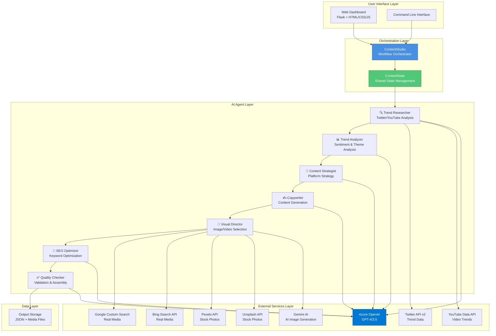
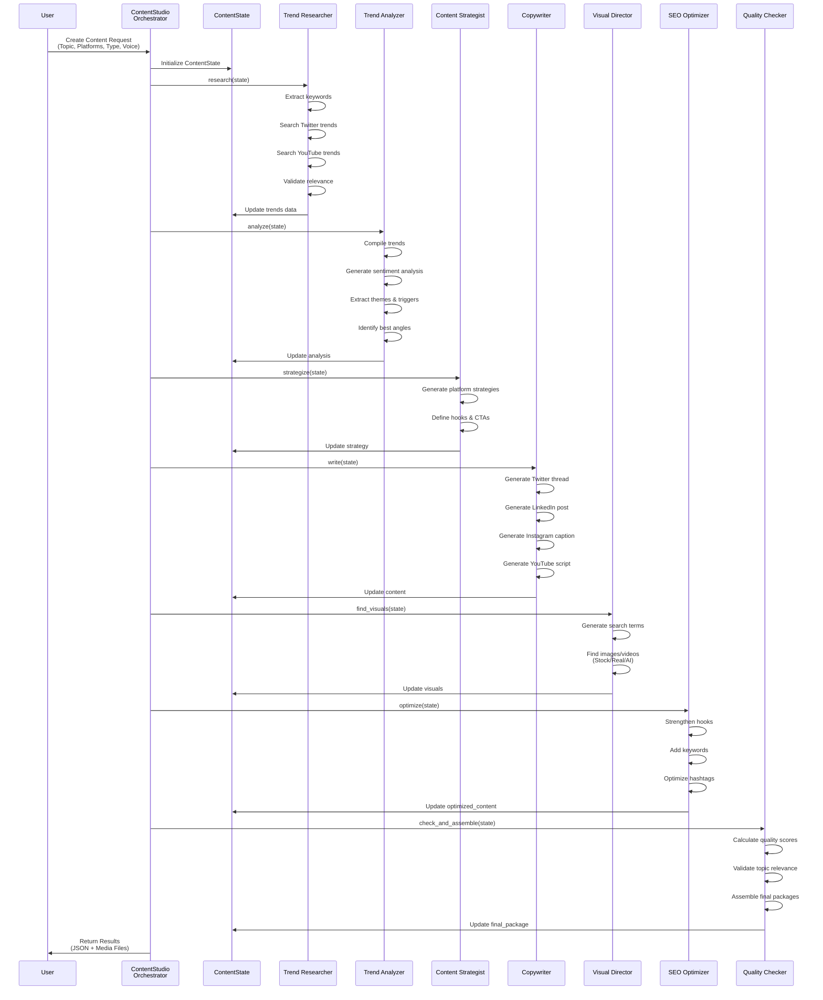
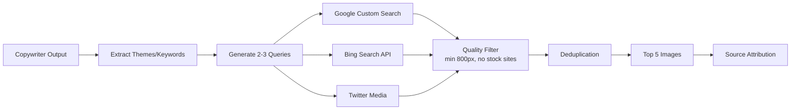
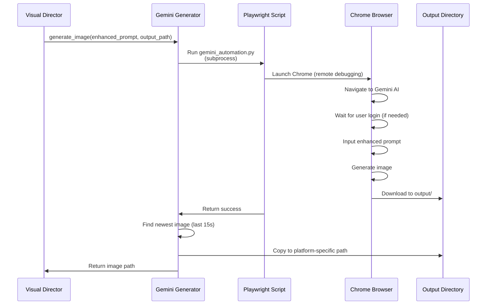

# 🏗️ System Architecture - Multi-Agent Content Creation Studio

## Executive Summary

The Multi-Agent Content Creation Studio is an AI-powered virtual content creation system that automates end-to-end social media marketing. By distributing creative and analytical tasks among specialized AI agents, the system produces professional-grade, platform-specific content at scale—completing a full week of campaigns in approximately 2 hours versus days of manual effort.

---

## 1. System Overview

### 1.1 Core Problem Statement

Traditional marketing demands significant time, money, and constant engagement across multiple platforms—challenges that small businesses and individuals often cannot meet. Manual content creation typically requires:
- **Time**: 3-5 days per week for multi-platform campaigns
- **Resources**: Dedicated team or expensive agencies
- **Expertise**: Platform-specific knowledge, SEO optimization, visual design
- **Consistency**: Maintaining brand voice across platforms

### 1.2 Solution Architecture

The system employs a **multi-agent architecture** built with LangGraph and LangChain, where each AI agent performs specialized tasks in a coordinated workflow. This approach enables:
- ✅ **Efficiency**: 2 hours vs. days for campaign creation
- ✅ **Quality**: Professional-grade content with SEO optimization
- ✅ **Scalability**: Simultaneous multi-platform content generation
- ✅ **Cost-Effectiveness**: Automated workflow without large budgets

---

## 2. High-Level Architecture



---

## 3. Agent Architecture & Workflow

### 3.1 Sequential Multi-Agent Pipeline

The system implements a **sequential workflow** where each agent builds upon the previous agent's work, ensuring context continuity and quality progression.



### 3.2 Agent Responsibilities

#### 🔍 **Agent 1: Trend Researcher**
- **Purpose**: Discover trending content across social platforms
- **Inputs**: Topic, keywords
- **Processing**:
  - Extract keywords from topic using NLP
  - Search Twitter API v2 (recent tweets, engagement metrics)
  - Search YouTube Data API v3 (trending videos, relevance ordering)
  - Filter results for relevance using keyword matching
  - Generate AI-based mock trends if APIs fail (fallback mechanism)
- **Outputs**: Trends data (tweets, videos, keywords)
- **Technologies**: Twitter API v2, YouTube Data API, Azure OpenAI

#### 📊 **Agent 2: Trend Analyzer**
- **Purpose**: Analyze sentiment, themes, and engagement patterns
- **Inputs**: Trends data, topic, content purpose
- **Processing**:
  - Compile trend summaries
  - Perform sentiment analysis (positive/negative/neutral)
  - Extract key themes (3-5 main themes)
  - Identify engagement triggers (hooks, emotions)
  - Determine best content angles
  - Adapt analysis for content purpose (marketing, educational, etc.)
- **Outputs**: Structured analysis (sentiment, themes, triggers, angles)
- **Technologies**: Azure OpenAI GPT (temperature 0.3 for precision)

#### 🎯 **Agent 3: Content Strategist**
- **Purpose**: Develop platform-specific content strategies
- **Inputs**: Analysis data, topic, content purpose, brand voice
- **Processing**:
  - Generate platform-specific strategies (Twitter, LinkedIn, Instagram, YouTube)
  - Define platform-appropriate hooks
  - Design call-to-action (CTA) strategies
  - Adapt tone for content purpose
- **Outputs**: Strategy document per platform
- **Technologies**: Azure OpenAI GPT (temperature 0.6)

#### ✍️ **Agent 4: Copywriter**
- **Purpose**: Create engaging, platform-optimized content
- **Inputs**: Strategy, topic, brand voice, content purpose, analysis
- **Processing**:
  - **Twitter**: 7-tweet threads with viral hooks, emojis, under 280 chars
  - **LinkedIn**: Professional posts (1000-1500 chars) with bullet points
  - **Instagram**: Captions with 25-30 hashtags, emojis, line breaks
  - **YouTube**: Full scripts or metadata (title, description, tags, thumbnails)
  - Ensure strict topic adherence (validation checks)
  - Adapt for 13+ content purposes (marketing, educational, quiz, etc.)
- **Outputs**: Platform-specific content
- **Technologies**: Azure OpenAI GPT (temperature 0.7 for creativity)

#### 🎨 **Agent 5: Visual Director**
- **Purpose**: Generate or find relevant images and media
- **Inputs**: Topic, copywriter output, strategy, SEO data
- **Processing**:
  - Extract AI-generated search terms
  - **Three visual modes**:
    1. **Stock Photos**: Unsplash/Pexels (high-quality, royalty-free)
    2. **Real Media Search**: Google/Bing/Twitter (content-aware queries, quality filtering, stock site exclusion)
    3. **AI Generated**: Gemini (custom prompts based on content strategy)
  - Multi-query strategy (2-3 queries per search)
  - Quality filtering (minimum 800px resolution)
  - Deduplication and source attribution
- **Outputs**: Image/video assets with metadata
- **Technologies**: Google Custom Search API, Bing Search API, Pexels API, Unsplash API, Gemini AI (Playwright automation)

#### 🚀 **Agent 6: SEO Optimizer**
- **Purpose**: Optimize content for search and engagement
- **Inputs**: Raw content, topic
- **Processing**:
  - Strengthen hooks (topic-focused)
  - Add keywords naturally
  - Improve hashtags (topic-relevant)
  - Enhance call-to-action
- **Outputs**: Optimized content (original + optimized versions)
- **Technologies**: Azure OpenAI GPT (temperature 0.6)

#### ✅ **Agent 7: Quality Checker**
- **Purpose**: Validate and assemble final deliverables
- **Inputs**: All agent outputs, topic
- **Processing**:
  - Calculate quality scores (0-100) based on:
    - Character count (platform limits)
    - Hashtag presence
    - Emoji usage
    - CTA inclusion
    - Line breaks (readability)
    - **Topic relevance** (keyword matching, 70% threshold)
  - Validate topic adherence
  - Assemble final packages with metadata
  - Generate posting time recommendations
- **Outputs**: Final content packages + quality scores
- **Technologies**: Azure OpenAI GPT, custom validation algorithms

---

## 4. Technical Stack

### 4.1 Core Technologies

| Layer | Technology | Purpose |
|-------|-----------|---------|
| **AI Framework** | LangChain & LangGraph | Multi-agent orchestration and workflow management |
| **AI Models** | Azure OpenAI (GPT-4/3.5) | Natural language generation and analysis |
| **Backend** | Python 3.8+ | Core application logic |
| **Web Framework** | Flask | Web API and server |
| **Frontend** | HTML5, CSS3 (Glassmorphism), Vanilla JavaScript | Modern web UI with real-time updates |
| **Browser Automation** | Playwright (Chromium) | Gemini AI image generation automation |
| **Configuration** | python-dotenv | Environment variable management |
| **Data Format** | JSON | Structured data storage and exchange |

### 4.2 External APIs & Services

#### Social Media APIs
- **Twitter API v2**: Trending tweet discovery, engagement metrics
- **YouTube Data API v3**: Video trend analysis, search capabilities

#### Visual Content APIs
- **Stock Photos**:
  - Pexels API (royalty-free images)
  - Unsplash API (high-quality photography)
- **Real Media Search**:
  - Google Custom Search API (verified sources, quality filtering)
  - Bing Search API (fallback search engine)
  - Twitter Media Search (social content extraction)
- **AI Generation**:
  - Gemini AI (custom image generation via Playwright)

#### AI Services
- **Azure OpenAI Service**:
  - Endpoint: Custom Azure resource
  - Deployment: GPT-4 or GPT-3.5-turbo
  - API Version: 2024-02-15-preview
  - Features: Retry logic, temperature control (0.3-0.7)

### 4.3 Development Tools

- **Version Control**: Git + GitHub
- **Dependency Management**: pip + requirements.txt
- **Environment**: Virtual environments (venv)
- **Code Organization**: Modular Python packages

---

## 5. Data Architecture

### 5.1 Shared State Management

The system uses a centralized `ContentState` dataclass for state management:

```python
@dataclass
class ContentState:
    topic: str                              # User-provided topic
    platforms: List[str]                    # Target platforms (Twitter, LinkedIn, etc.)
    content_type: str                       # Content format + purpose
    brand_voice: str                        # Brand tone (professional, casual, etc.)
    visual_style: str                       # Visual mode (stock, real, ai)
    trends: Dict                            # Trend Researcher output
    analysis: Dict                          # Trend Analyzer output
    strategy: Dict                          # Content Strategist output
    content: Dict                           # Copywriter output
    optimized_content: Dict                 # SEO Optimizer output
    visuals: Dict                           # Visual Director output
    final_package: Dict                     # Quality Checker output
    messages: List[str]                     # Agent status messages
```

### 5.2 Output Structure

Generated content is saved with the following structure:

```
content_studio_output/
└── <topic>_<YYYYMMDD_HHMMSS>/
    ├── metadata.json                  # Complete workflow data
    ├── twitter.txt                    # Twitter thread
    ├── linkedin.txt                   # LinkedIn post
    ├── instagram.txt                  # Instagram caption
    ├── youtube.txt                    # YouTube script
    ├── twitter_image.jpg             # Platform-specific visuals
    ├── linkedin_image.jpg
    ├── instagram_image.jpg
    └── youtube_thumbnail.jpg
```

**metadata.json** contains:
- Full agent outputs (trends, analysis, strategy, content)
- Quality scores per platform
- Posting time recommendations
- Visual asset URLs and attributions
- Content type and purpose
- Brand voice settings

---

## 6. Integration Architecture

### 6.1 Real Media Search Integration

**Multi-Query Content-Aware Search**:



**Stock Site Exclusion**:
- Filters out: Getty Images, Shutterstock, iStock, Adobe Stock, Alamy, etc.
- Prioritizes: Authentic, non-commercial sources
- Fallback: Returns stock images if all real media filtered

### 6.2 AI Image Generation Integration

**Gemini Automation Workflow**:



**Enhanced Prompt Generation**:
- Analyzes copywriter output (themes, tone, keywords)
- Extracts content strategy elements
- Incorporates SEO keywords
- Combines topic + platform style + visual elements
- Example: "AI in Healthcare, machine learning diagnosis, professional innovative, high-tech medical visualization, LinkedIn professional style, high quality, commercial photography"

### 6.3 Azure OpenAI Integration

**Client Configuration**:
- Custom retry logic (max 2 retries)
- Exponential backoff (1s, 2s)
- Temperature variation by task:
  - Trend Analysis: 0.3 (precision)
  - Strategy: 0.6 (balanced)
  - Copywriting: 0.7 (creativity)
- Error handling with fallback mechanisms

---

## 7. Content Type System

### 7.1 Purpose-Driven Content

The system supports 13+ content purposes, each with tailored strategies:

| Purpose | Optimization Focus | Example CTAs |
|---------|-------------------|--------------|
| **Social Media Marketing** | Viral hooks, shareability | "Tag a friend who needs this!" |
| **Advertisement** | Conversion, urgency | "Shop now - 50% off!" |
| **Educational** | Step-by-step learning | "Save this for later!" |
| **Entertainment** | Storytelling, humor | "What's your favorite?" |
| **Quiz** | Interactive engagement | "Test your knowledge!" |
| **Q&A** | Expert insights | "Ask me anything!" |
| **Lead Generation** | Value + lead magnets | "Download free guide" |
| **Brand Awareness** | Emotional storytelling | "Join our community" |
| **Promotional** | Launches, events | "Limited time only!" |
| **Engagement** | Polls, questions | "Vote in the comments!" |
| **Informational** | Facts, data | "Learn more at [link]" |

### 7.2 Content Format Parsing

**Format Types**:
- `post`: Standard social media posts (images)
- `video`: Video scripts with metadata
- `carousel`: Multi-image posts (Instagram)
- `article`: Long-form content
- `story`: Temporary content (Instagram/Facebook Stories)

**Purpose Types**: Extracted from user input (e.g., "post - Social Media Marketing")

---

## 8. Quality Assurance & Validation

### 8.1 Topic Relevance Validation

**Multi-Level Validation**:
1. **Trend Researcher**: Keyword-based filtering (relevance check)
2. **Copywriter**: Strict topic prompts ("Every sentence must relate to {topic}")
3. **Quality Checker**: 
   - Extract topic keywords
   - Check content for keyword presence
   - Require 70% keyword match threshold
   - Reject generic content

### 8.2 Quality Scoring Algorithm

```python
def calculate_quality_score(content, topic, platform):
    score = 0
    
    # Character count (platform-appropriate)
    if meets_platform_length(content, platform): score += 20
    
    # Hashtags present
    if has_hashtags(content): score += 15
    
    # Emojis used
    emoji_count = count_emojis(content)
    score += min(emoji_count * 3, 15)
    
    # CTA inclusion
    if has_call_to_action(content): score += 10
    
    # Questions (engagement)
    if '?' in content: score += 5
    
    # Line breaks (readability)
    if has_adequate_breaks(content): score += 5
    
    # Topic relevance (* MOST CRITICAL *)
    relevance_score = calculate_topic_relevance(content, topic)
    if relevance_score >= 0.7: score += 20
    
    return min(score, 100)
```

### 8.3 Error Handling & Fallbacks

**Tier 1 - API Failures**:
- Twitter API → AI-generated mock trends
- YouTube API → AI-generated video concepts
- All visual APIs → Automatic fallback chain (AI → Real → Stock)

**Tier 2 - Generation Failures**:
- Azure OpenAI retry logic (2 attempts, exponential backoff)
- Gemini AI → Falls back to Real Media Search → Falls back to Stock Photos

**Tier 3 - Validation Failures**:
- Topic relevance check failure → Content regeneration
- Quality score < 50 → Warning message to user

---

## 9. Web Interface Architecture

### 9.1 Frontend Architecture

```
web/
├── api.py                          # Flask API server
├── templates/
│   └── index.html                 # Single-page application
└── static/
    ├── css/
    │   ├── styles.css            # Main styles (glassmorphism)
    │   ├── hero_enhanced.css     # Hero section styles
    │   └── workflow.css          # Workflow animation styles
    ├── js/
    │   └── app.js                # Frontend logic
    └── images/
        └── bg.jpg                 # Background assets
```

### 9.2 UI Features

**Real-Time Dashboard**:
- Live workflow visualization (agent progress tracking)
- Platform-specific content preview cards
- Visual asset display (images/videos)
- Quality score indicators
- Download functionality

**Design System**:
- Glassmorphism design (frosted glass effects)
- Dark mode optimized
- Responsive layout (desktop/tablet/mobile)
- Smooth animations and transitions
- Accessible color contrasts

### 9.3 API Endpoints

#### POST /generate_content
```json
{
  "topic": "AI in Healthcare",
  "platforms": ["twitter", "linkedin", "instagram", "youtube"],
  "content_type": "post - Social Media Marketing",
  "brand_voice": "professional yet engaging",
  "visual_style": "stock"
}
```

**Response**:
```json
{
  "twitter": {
    "platform": "twitter",
    "content": "Tweet 1/7:\n🚀 AI in Healthcare...",
    "visuals": {
      "type": "images",
      "assets": [{"url": "...", "photographer": "..."}]
    },
    "metadata": {...},
    "quality_score": 85,
    "posting_time": "2025-12-18 14:30",
    "status": "ready"
  },
  // ... other platforms
}
```

---

## 10. Performance & Scalability

### 10.1 Performance Metrics

| Metric | Value | Notes |
|--------|-------|-------|
| **Generation Time** | 30-90 seconds | Per complete content package (all platforms) |
| **API Rate Limits** | Automatic retry | Respects all API quotas with exponential backoff |
| **Content Quality** | Temperature 0.3-0.7 | Balanced creativity vs. precision |
| **Image Quality** | Minimum 800px | Real media searches |
| **Multi-Query Search** | 2-3 queries | Per image search for better results |
| **Throughput** | 1 week of campaigns | In ~2 hours (vs. days manually) |

### 10.2 Scalability Considerations

**Horizontal Scaling**:
- Stateless agent design (can be distributed)
- API-based external services (cloud-native)
- Async-capable architecture (currently synchronous but refactorable)

**Vertical Scaling**:
- Temperature tuning for cost/quality trade-offs
- Batch processing capabilities
- Caching strategies for repeated topics

**Future Enhancements**:
- Queue-based job processing (Celery/RabbitMQ)
- Database integration (PostgreSQL/MongoDB)
- Caching layer (Redis)
- Containerization (Docker/Kubernetes)
- Multi-tenancy support

---

## 11. Security & Compliance

### 11.1 API Key Management

- **.env file**: Stores sensitive credentials (excluded from git via .gitignore)
- **Environment variables**: Loaded via python-dotenv
- **No hardcoded secrets**: All keys configurable

### 11.2 Data Privacy

- **No user data storage**: Content generated on-demand
- **No external tracking**: Local-only processing
- **Source attribution**: Copyright compliance for real media

### 11.3 Rate Limiting

- **Twitter API**: Automatic fallback to AI-generated trends
- **YouTube API**: Quota management with error handling
- **Visual APIs**: Sleep intervals (0.5s) between requests
- **Azure OpenAI**: Retry logic with exponential backoff

---

## 12. Deployment Architecture

### 12.1 Local Development

```bash
# Environment setup
python -m venv venv
source venv/bin/activate  # or venv\Scripts\activate (Windows)
pip install -r requirements.txt

# API configuration
cp .env.example .env  # Configure API keys

# Run CLI
python src/content_studio.py

# Run Web Interface
launch_chrome.bat  # (if using Gemini AI)
python web/api.py
# Open http://localhost:8000
```

### 12.2 Production Considerations

**Web Server**:
- Gunicorn/uWSGI for Flask (production WSGI server)
- Nginx reverse proxy
- SSL/TLS certificates

**Process Management**:
- Systemd or Supervisor for service management
- Auto-restart on failures

**Monitoring**:
- Application logging (structured JSON logs)
- Error tracking (Sentry/Rollbar)
- Performance monitoring (New Relic/DataDog)

**Cloud Deployment Options**:
- **Azure App Service**: Native Azure OpenAI integration
- **AWS Elastic Beanstalk**: Python application hosting
- **Google Cloud Run**: Containerized deployment
- **Heroku**: Rapid prototyping

---

## 13. Future Enhancements

### 13.1 Planned Features

- [ ] **Additional Platforms**: TikTok, Reddit content generation
- [ ] **Automated Posting**: Direct API integration for scheduling
- [ ] **Content Calendar**: Multi-week campaign planning
- [ ] **A/B Testing**: Content variant suggestions
- [ ] **Analytics Integration**: Performance tracking and insights
- [ ] **Multi-Language Support**: Localization for global markets
- [ ] **Video Generation**: Actual video creation (not just scripts)
- [ ] **Transformer Models**: Custom sentiment analysis and engagement prediction

### 13.2 Technical Roadmap

**Phase 1 - Enhanced AI**:
- Custom transformer models for sentiment analysis
- Fine-tuned models for engagement prediction
- Advanced content recommendation engine

**Phase 2 - Platform Expansion**:
- TikTok script generation with trending sounds
- Reddit post optimization with subreddit targeting
- Pinterest pin creation

**Phase 3 - Automation**:
- Direct posting to social platforms (OAuth integration)
- Calendar-based scheduling system
- Automated content distribution

**Phase 4 - Intelligence**:
- Performance analytics dashboard
- A/B testing framework
- Predictive engagement scoring

---

## 14. Conclusion

The Multi-Agent Content Creation Studio represents a significant advancement in automated content marketing. By leveraging specialized AI agents, external APIs, and intelligent workflow orchestration, the system delivers:

✅ **Speed**: 2 hours vs. days for campaign creation  
✅ **Quality**: Professional-grade, platform-optimized content  
✅ **Scale**: Multi-platform simultaneous generation  
✅ **Intelligence**: Trend-aware, SEO-optimized, purpose-driven content  
✅ **Cost**: Affordable automation without agency budgets  

The architecture is designed for extensibility, with clear separation of concerns and modular agent design enabling future enhancements without major refactoring.

---

## 15. References

### Documentation
- [Project README](../README.md)
- [Web UI Documentation](../WEB_UI_README.md)
- [Requirements](../requirements.txt)

### External APIs
- [Azure OpenAI Documentation](https://learn.microsoft.com/en-us/azure/ai-services/openai/)
- [Twitter API v2 Documentation](https://developer.twitter.com/en/docs/twitter-api)
- [YouTube Data API Documentation](https://developers.google.com/youtube/v3)
- [Google Custom Search API](https://developers.google.com/custom-search)
- [Pexels API Documentation](https://www.pexels.com/api/documentation/)
- [Unsplash API Documentation](https://unsplash.com/documentation)

### Frameworks
- [LangChain Documentation](https://python.langchain.com/)
- [LangGraph Documentation](https://langchain-ai.github.io/langgraph/)
- [Flask Documentation](https://flask.palletsprojects.com/)

---

**Document Version**: 1.0  
**Last Updated**: December 18, 2025  
**Author**: Content Creation Studio Team
